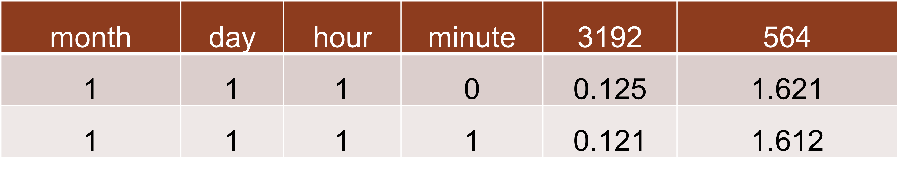
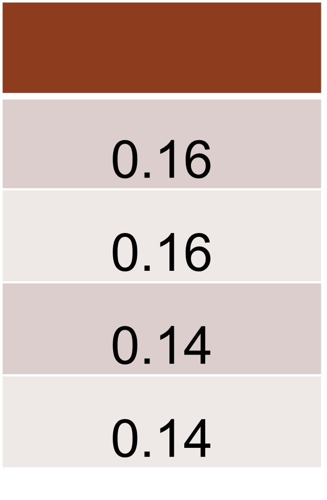
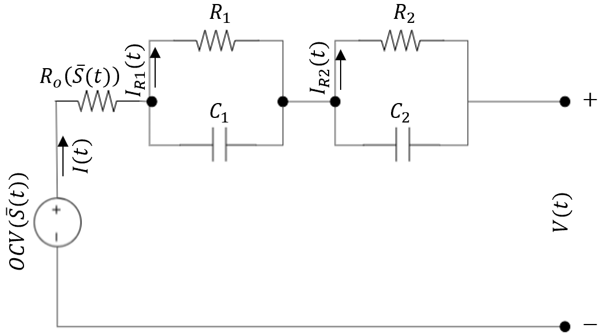
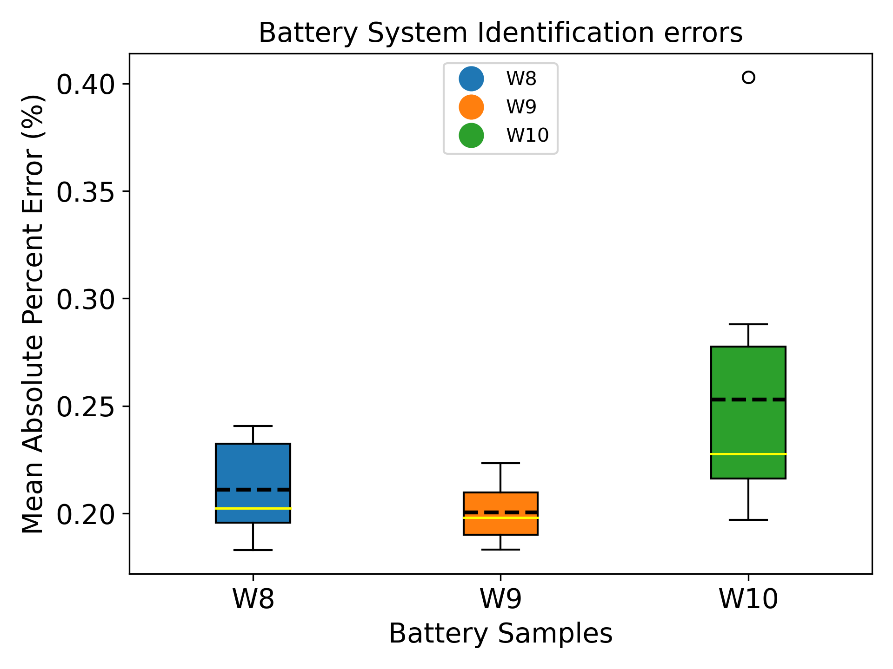
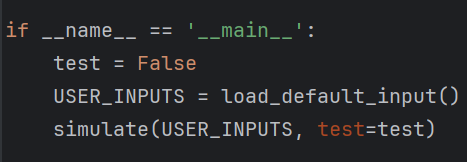

A grid-aware co-simulation platform for the design and optimization of electric vehicle charging infrastructure. 
Paper: https://doi.org/10.1109/TSG.2023.3339374 

[//]: # (![sim_frame.png]&#40;doc_images%2Fsim_frame.png&#41;)

## Authors
Emmanuel Balogun (Project lead): ebalogun@stanford.edu, Lily Buechler: ebuech@stanford.edu

## Contribution
We welcome all contributions to the project, including documentation and feature improvements, etc. 
Please see the [CONTRIBUTING.md](CONTRIBUTING.md) file for more details.

## Correspondence
For more detailed questions, potential collaborations, suggestions and discussions, or assistance that cannot be done directly on github, please reach out to project lead.

## Requirements
1. See `requirements.txt` for **required** packages. The `environment.yml` file can be used to create a new conda environment with the required packages. 
   The `environment.yml` file can be used to create a new conda environment with the required packages. 
   To create a new environment using `conda env create --name <your env name> -f environment.yml` OR 
   install packages listed in the environment manually. You can also use the `requirements.txt` file to install the required packages.

2. Arras-energy (SLAC) GridLAB-D installation (master branch). See repository [here](https://github.com/arras-energy/gridlabd) for details. This is required for the power grid co-simulation functionality. 
   This is not necessary if one does not consider the power system voltage impacts.

3. Gurobi License [recommended]. Free (educational) or commercial Gurobi Licenses can be obtained [here](https://www.gurobi.com/)

4. MOSEK License [optional]. Free (educational) or commercial MOSEK License can be obtained [here](https://www.mosek.com/products/academic-licenses/)

## Folder descriptions

### data/ambient_data
Hosts ambient temperature data for capturing the effects of environmental conditions on subsystems, such as battery, 
transformers, charging stations.

### data/base_load_data
Includes existing base case building/home load (usually uncontrollable) within the distribution grid. This work uses 
proprietary Pecan Street Data. Below is an exmaple data prototype for the base load data. Note that column fields are
case-sensitive. The data used in the original paper has a minute resolution, as is the power system simulation. A csv 
file with the data prototype is also provided in `base_load_data/data_use.csv`. The fields: month, day, and 
hour are indexed from 1. For example 1 - January, 12 - December. The fields: minute and second are indexed from 0. For
example 0 - 59. The rest of the columns represented by numbers are anonymized building loads in kilo-watts (kW).
For the paper, the `base_load_data/data_use.csv` contained the actual data from Pecan Street, 
but unfortunately cannot be shared due to proprietary data rights. However, there are free versions of Pecan Street data
that can be used within the plaform by simply replacing the csv file with the appropriate load data file.

### data/elec_rates
Includes .csv files for electricity Time-of-use (TOU) rates. The input data prototype for electricity rates
is shown below. User must upload a normal full-year sized data (for 365 days) to avoid
any errors.

The data required must be in the format shown above. If you upload your own electricity rate data, navigate to `charging_sim/configs/prices.json` and modify the *data_path* field
to ensure that the *data_path* field matches the uploaded custom price data. The `electricityPrices.py` module will read 
the time-of-use (TOU) price data and sample prices during optimization and simulation. The data should be one full year of TOU rate prices at 15 minute resolution.
The `electricityPrices.py` module can also help with downscaling the data to 15 minute resolution if the data is at a
much coarser resolution. The module will save the downscaled data in the `elec_rates` folder.

### data/solar_data
`solar_data` folder includes solar irradiance data for capturing the effects of environmental conditions on overall system cost. Default
data for solar irradiance is from the National Solar Radiation Database (NSRDB) for the San Francisco Bay Area.
The data prototype is from the National Renewable Energy Laboratory (NREL) and is shown below. Note that column fields
are case-sensitive. If you upload your own solar irradiance data, navigate to `charging_sim/configs/solar.json` and modify 
the *data_path* field to ensure that the *data_path* field matches the uploaded custom solar data.

Month labels are indexed from 1 to 12, inclusive; 1 - January, 12 - December. The original data is in hourly resolution.
The *EV-EcoSim* data prototype is in 15 minute intervals by default, with irradiance oversampled 4 times from hourly 
dataset. The GHI represents the "Global Horizontal Irradiance" in W/m^2, which is the total amount of shortwave radiation
received from above by a surface horizontal to the ground. 

### batt_sys_identification
Battery system identification module. Hosts the class for generating battery system identification parameters
from experimental data. This module leverages a genetic algorithm to optimize the battery model parameters. 
The battery model is a 2nd order RC Equivalent circuit model (ECM). One can use this module to generate custom NMC
battery parameters by uploading experimental data to the `batt_sys_identification/data` folder and running the module.
The module will generate a `.csv` file with the battery parameters in the `batt_sys_identification` folder.
The data prototype is shown below. Note that column fields are case-sensitive.

[//]: # ( )

[//]: # (
)

[//]: # (  )

[//]: # (  <figcaption>Equivalent circuit model &#40;ECM&#41; for battery system identification</figcaption>)

[//]: # (
)

[//]: # ( )

The module will save a new `.csv` file with an additional field for the corrected open circuit voltage (OCV) values;
this field (column) will be labelled `ocv_corr` within the new battery data csv, including the existing columns as shown
in the data prototype above.

Once the battery parameters are generated, they can be used in the `data/battery_data` folder and `charging_sim/configs/battery.json` can 
be modified so the model runs using the new custom parameters.

The image below shows the battery model error (MAPE) for the NMC battery model parameters generated from the module for 
3 different sample cells over 10 different trials. The model is trained for only 40 generations (or iterations) of the 
genetic algorithm with a population of 10. 

[//]: # (![battery_model_error_mape.png]&#40;doc_images%2Fbattery_model_error_mape.png&#41;)

### charging_sim
This folder encompasses the implementation of the physical modules, including:

 * `battery.py` - Battery cell module.
 * `batteryAgingSim.py` - Battery aging module.
 * `batterypack.py` - Battery pack module.
 * `chargingStation.py` - Charging station module.
 * `clock.py` - Clock module.
 * `controller.py` - Controller module.
 * `electricityPrices.py` - Electricity prices module
 * `node.py` - Node module (for centralized DER control and optimization).
 * `optimization.py` - Optimization module.
 * `orchestrator.py` - Simulation orchestrator module.
 * `simulate.py` - Offline DER control optimization for cost minimization (this is run for offline mode (no state feedback)).
 * `solar.py` - Solar PV module.
 * `transformer.py` - Transformer module.
 * `utils.py` - Hosts utility functions used by some modules.

There also contains the `configs` folder under the `charging_sim` folder. The `configs` folder which includes the 
configuration files for all the relevant modules, such as battery, transformer, solar, clock modules, etc. 

### DLMODELS
This includes legacy load forecasts models developed (not needed).

### feeders
Library of IEEE test feeders and PNNL taxonomy feeders for distribution systems in the GridLAB-D `.glm` format.
IEEE feeders have spot loads specified at primary distribution level. PNNL taxonomy feeders have spot loads specified at
primary or secondary distribution level.

### feeder_population
Scripts for populating base feeder models with time-varying loads and resources using the load data in base_load_data. 
`feeder_population.py` generates the necessary files for a co-simulation run based on the parameters specified in 
`test_cases/{CASE_NAME}/feeder_population/config.txt`. Feeder population requires residential load data not included in repo (limited access) due to proprietary data rights. However, there are 
free versions of Pecan Street data that may be replaced in the `base_load_data` folder; file should be named `data_use.csv`.

### test_cases

#### Co-simulation cases.
 `base_case`- Reads voltage from GridLAB-D and writes power injections at each timestep (no EV charging or DER).
`battery` - base_case plus transformer thermal model plus DER integration (included battery and solar).

### analysis
Scripts for plotting and analysis of co-simulation results. Includes post optimization and simulation cost 
calculation modules and voltage impacts on the distribution grid.

`plot_results.py` - This module is used post-simulation to parse the voltages from the power-simulation to calculate the percentage
voltage violations per ANSI C84.1. The file also generates voltage distribution plots. A user can modify the
SIMULATION_FOLDER variable which is the string of the path where the powerflow simulation output voltages at each node
exist.

`load_post_opt_costs.py` - This module calculates the levelized cost of energy and populates into tables/cost matrices, which are saved in the
respective files and folders. The module also generates plots for the cost analysis.  

`cost_analysis.py` - This module contains the `CostEstimator` class, which estimates the cost of the different grid and DER components
from the simulation.

## How to run

1. If you do not have conda installed and want to use conda, please follow the instructions [here](https://docs.conda.io/projects/conda/en/latest/user-guide/install/index.html) to install conda.

2. Create a new environment using `conda env create --name <your env name> -f environment.yml`OR 
install packages listed in the environment manually. You can also use the `requirements.txt` file to install the required packages or use [pip](https://packaging.python.org/en/latest/guides/installing-using-pip-and-virtual-environments/).

3. Ensure gridlabd is installed by following recommended installation method if using the online (MPC) power system co-simulation functionality.

4. For offline (One-shot) optimization simulation (Does not require GridLAB-D install):
   * Open the `default_user_inputs.json` file in the root folder and modify the parameters as needed. The prepopulated
     fields can be modified. Once the fields are modified as desired, navigate to `app.py` which is also in the root directory. Make sure the *test* is set to *False* (see below) in the `app.py` file. 
  
     

     Then run `app.py`. This will run the simulation and generate the results in the `results` folder under the `analysis` directory. To perform post-simulation cost 
     analysis, navigate to the `analysis` folder and run `load_post_opt_costs.py`. This will generate the cost analysis plots and tables in the `analysis` folder.
 
5. For online MPC battery test case (Requires GridLAB-D install):
   * Navigate to `test_cases/battery/feeder_population` and run `feeder_population_collocated.py` for collocated (DEFAULT) case or `feeder_population_centralized.py`. This uses the 
     `test_cases/battery/feeder_population/config.txt` settings to prepare the power system and populate the secondary
     distribution network with time-varying base loads, EV charging stations, Distributed Energy Resources (DERs - Solar, Storage), and required transformers.
   * Once confirmed that `feeder_population_<CASE_TYPE>.py` (CASE_TYPE is either collocated or centralized) has run successfully and generates the required `IEEE123_secondary.glm` and
     `IEEE123_populated.glm` files, you are done with the initial pre-simulation run preparation.
   * Now navigate one level of out `/feeder_population` and run scenarios.py using `python3 scenarios.py` or `gridlabd python scenarios.py` (recommended).

6. For base case (Requires GridLAB-D install):
   * Navigate to `./test_cases/base_case/feeder_population` and run `feeder_population.py`. This uses the 
     `./test_cases/base_case/feeder_population/config.txt` settings to prepare the power system and populate the secondary distribution network \
     with time-varying base loads
   * Navigate back one directory to `./test_cases/base_case` and run master_sim.py using `python3 master_sim.py`

## Post-simulation analysis
 * This is done with the modules in the `analysis` folder. Please see the `analysis` folder section  for more details.

## Acknowledgements
This work was supported in part by Stanford Bits and Watts, Chevron Energy Fellowship, and Siemens Technology.
