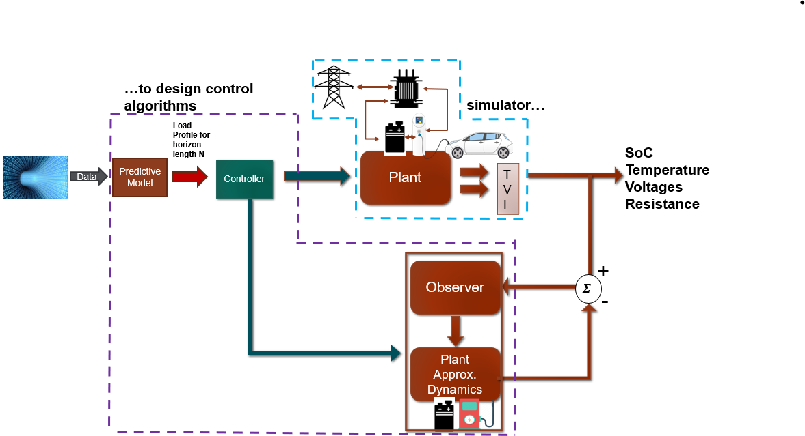

.. EV-Ecosim documentation master file, created by
   sphinx-quickstart on Wed Aug  9 14:16:15 2023.
   You can adapt this file completely to your liking, but it should at least
   contain the root `toctree` directive.

=====================================
Welcome to *EV-Ecosim* 1.0.0 documentation!
=====================================

--------------------------------

--------------------------------
What is *EV-Ecosim*?
--------------------------------
EV-Ecosim is a python-based multi-timescale grid-aware co-simulation platform for modeling, control, optimization,
and simulation of electric vehicle (EV) charging stations. The charging infrastructure developed within this platform is
integrated with Distributed Energy Resources (DERs), such as solar and battery systems. This platform interfaces with
GridLAB-D, a 3-phase unbalanced power flow solver, to capture the impacts of EV (Fast) Charging Stations on power
distribution networks.

Links
--------
- `Preprint <https://doi.org/10.36227/techrxiv.23596725.v2>`_
- `Repository <https://github.com/ebalogun01/EV50_cosimulation/>`_
-  Web-tool (coming soon!)

.. toctree::
   :hidden:
   :maxdepth: 1

   Introduction<Introduction/welcome>

.. toctree::
   :hidden:
   :maxdepth: 2
   :caption: Tutorials:

   Tutorial<tutorials>

.. toctree::
   :hidden:
   :maxdepth: 2

   Readme<readme/README>

.. toctree::
    :hidden:
    :maxdepth: 1
    :caption: Modules

    modules

Indices and tables
==================

* :ref:`genindex`
* :ref:`modindex`
* :ref:`search`
